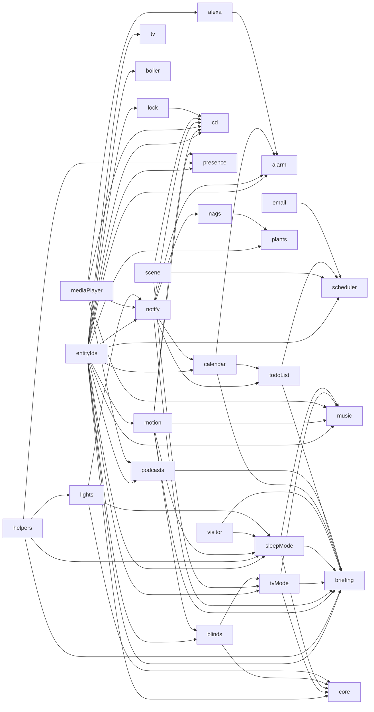

# Ben's Flat Behaviours

This document maps the automations currently wired in [`src/libraries/bens-flat/bens-flat.library.ts`](/Users/benwainwright/repos/da-automations/src/libraries/bens-flat/bens-flat.library.ts).

It focuses on runtime behaviour:

- what triggers an automation
- which mode or state it updates
- which side effects it causes

## Behaviour Map

```mermaid
flowchart TD
  classDef mode fill:#f6f2ff,stroke:#6b46c1,color:#2d1b69
  classDef trigger fill:#eef8ff,stroke:#0b69a3,color:#0b3558
  classDef action fill:#effaf1,stroke:#2f855a,color:#163d2b
  classDef data fill:#fff8e8,stroke:#b7791f,color:#5c3b00
  classDef schedule fill:#fff2f2,stroke:#c53030,color:#5f1d1d

  subgraph Inputs["External Inputs"]
    Motion["Room motion sensors
    living room / hallway / spare room / bedroom / bathroom"]:::trigger
    Zone["zone.home occupancy count"]:::trigger
    Door["front door sensor"]:::trigger
    LockState["front door lock state"]:::trigger
    Sunset["sunset event"]:::trigger
    AppleTV["Apple TV state"]:::trigger
    Xbox["Xbox in-game sensor"]:::trigger
    PS5["PS5 now playing sensor"]:::trigger
    SleepEvent["sleep_mode_event socket event"]:::trigger
    PlantState["plant states"]:::trigger
    CalendarInput["personal calendar"]:::trigger
    Todoist["Todoist API"]:::trigger
    Person["person.ben + proximity sensors"]:::trigger
    Deploy["auto-deploy lifecycle events"]:::trigger
  end

  subgraph Modes["Derived Modes And Control Switches"]
    Occupied["Flat Occupied"]:::mode
    Visitor["Visitor Mode"]:::mode
    Sleep["Night Mode"]:::mode
    TVMode["TV Mode"]:::mode
    CDMode["CD Mode"]:::mode
    QuickLock["QuickLock mode"]:::mode
    Reminders["Reminders"]:::mode
    NagMode["Nag Mode"]:::mode
    MusicAuto["Autoplay Music"]:::mode
    BlindsDefault["Blinds default closed"]:::mode
    BoilerMain["Boiler virtual switch"]:::mode
    BoilerBoost["Boiler Boost virtual switch"]:::mode
  end

  subgraph Core["Home Behaviour"]
    MotionLights["Motion lighting
    area lights on, timed auto-off"]:::action
    AllLightsOff["Turn off all lights"]:::action
    BlindsOpen["Open living room blinds"]:::action
    BlindsClose["Close living room blinds"]:::action
    LockDoor["Lock front door"]:::action
    LockLogs["Fetch Nuki unlock logs"]:::action
  end

  subgraph Media["Media And Speech"]
    PauseWholeFlat["Pause whole-flat audio"]:::action
    TVScene["Apply / restore TV scene"]:::action
    SexyScene["Apply / restore scene.sexy"]:::action
    TVPower["Turn TV on, select Apple TV source, or turn TV off"]:::action
    BriefingSpeech["Speak morning briefing"]:::action
    ReminderSpeech["Speak Todo reminders"]:::action
    CalendarSpeech["Speak remaining events"]:::action
    AlarmSpeech["Speak alarm setup result"]:::action
    CriticalSpeech["Critical speech + light flash + TV alert"]:::action
    Playlist["Play random favourite playlist"]:::action
    Podcast["Play latest news podcast"]:::action
    DoorBoop["Play boop.mp3 on whole flat speakers"]:::action
    AlexaAlarm["Send Alexa custom command to bedroom speaker"]:::action
  end

  subgraph Schedules["Scheduled Jobs"]
    NightAudioOn["22:00: turn on night audio scene"]:::schedule
    NightAudioOff["09:00: turn off night audio scene"]:::schedule
    TodoScheduleJob["04:00: schedule Todoist tasks"]:::schedule
    MondayMeter["Mon 09:00: send electricity meter reading email"]:::schedule
    FiveAM["05:00: enable reminders + adaptive lighting"]:::schedule
    NagLoop["Every 30m: evaluate registered nags"]:::schedule
  end

  subgraph DataJobs["Data / Utility Jobs"]
    CalendarStrings["Build today's / remaining calendar strings"]:::data
    TodoStrings["Build todo summary string"]:::data
    GoingHome["Learning sensor: going-home feature recorder"]:::data
    DeployNotify["Persistent deploy status notification"]:::action
    Email["Send email via Gmail notify service"]:::action
  end

  Motion --> Occupied
  Zone --> Occupied
  Occupied -- "off" --> AllLightsOff
  Occupied -- "off" --> BlindsClose
  Occupied -- "on" --> BlindsOpen

  Motion --> MotionLights
  TVMode -. blocks living room motion lights .-> MotionLights
  Sleep -. blocks bedroom motion lights .-> MotionLights

  Sunset --> BlindsDefault
  Motion -- "living room motion after 05:00 before sunset" --> BlindsDefault
  CDMode -. keeps blinds default closed .-> BlindsDefault
  BlindsDefault -- "on" --> BlindsClose
  BlindsDefault -- "off" --> BlindsOpen

  AppleTV --> TVPower
  TVPower --> TVMode
  Xbox --> TVMode
  PS5 --> TVMode
  AppleTV --> TVMode
  TVMode -- "on" --> PauseWholeFlat
  TVMode -- "on" --> TVScene
  TVMode -- "on" --> BlindsClose
  TVMode -- "off for 5m" --> BlindsOpen

  Door -- "closed while unlocked and quicklock on" --> LockDoor
  LockState -- "locked -> unlocking" --> LockLogs

  CDMode -- "on" --> QuickLock
  CDMode -- "on" --> SexyScene
  CDMode -- "off" --> SexyScene
  CDMode -- "off" --> QuickLock
  Door -- "opened while CD mode on" --> DoorBoop
  Motion -- "bedroom / spare room while CD mode on" --> CriticalSpeech

  SleepEvent --> Sleep
  Sleep -- "on" --> AllLightsOff
  Sleep -- "on" --> AlarmSpeech
  Sleep -- "on" --> MusicAuto
  Sleep -- "on" --> Reminders
  Sleep -- "off morning trigger" --> Sleep
  Visitor -. prevents auto exit from sleep mode .-> Sleep
  Motion -- "living room motion after 05:00 before 15:00" --> Sleep

  Motion -- "living room / hallway / bathroom after 05:00 before 15:00" --> BriefingSpeech
  Sleep -- "turned on resets one-shot briefing latch" --> BriefingSpeech
  Visitor -. blocks automatic morning briefing .-> BriefingSpeech
  BriefingSpeech --> CalendarStrings
  BriefingSpeech --> TodoStrings
  BriefingSpeech --> Podcast
  BriefingSpeech --> MusicAuto

  Reminders -- "on" --> ReminderSpeech
  Motion -- "anywhere after 13:30 if not sleeping / TV / CD" --> ReminderSpeech
  ReminderSpeech --> TodoStrings

  CalendarInput --> CalendarStrings
  CalendarInput --> AlarmSpeech
  CalendarInput --> GoingHome
  CalendarStrings --> CalendarSpeech
  AlarmSpeech --> AlexaAlarm

  MusicAuto -- "on + motion + nothing already playing" --> Playlist
  TVMode -- "on pauses autoplay" --> MusicAuto
  Sleep -- "on pauses autoplay" --> MusicAuto

  Todoist --> TodoStrings
  Todoist --> TodoScheduleJob
  TodoScheduleJob --> Todoist
  TodoScheduleJob --> CalendarInput
  TodoScheduleJob -- "failure" --> CriticalSpeech

  NightAudioOn --> TVScene
  NightAudioOff --> TVScene
  MondayMeter --> Email
  FiveAM --> Reminders
  FiveAM --> MusicAuto

  PlantState --> NagLoop
  NagMode --> NagLoop
  NagLoop -- "problem plant" --> CriticalSpeech

  Deploy --> DeployNotify
  Person --> GoingHome
```

## Service Dependency Map

This is the library-level dependency wiring, not the runtime event flow.

## Notes

- `BatteryService` exists but is not currently registered in the `bens-flat` library, so it is not part of the live behaviour map.
- `GoingHomeRecorderService` is a feature-recording pipeline for the `learning_sensors` library. It watches `person.ben`, home proximity, and calendar context to emit a derived `going-home` sensor rather than directly controlling devices.
- `NotificationService` is shared infrastructure used by multiple services. In practice it fans out to TTS on the flat speakers, TV notifications when the TV is on, phone notifications, persistent notifications, and light flashing for critical alerts.
